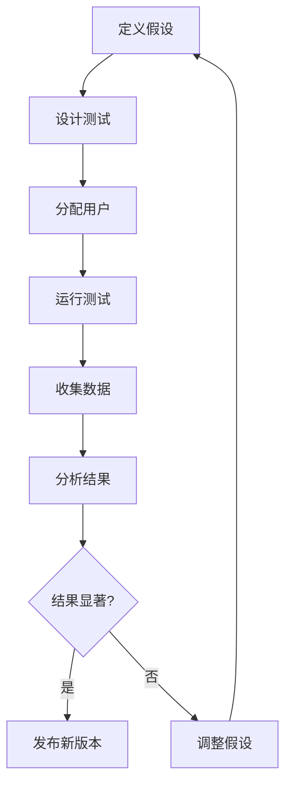
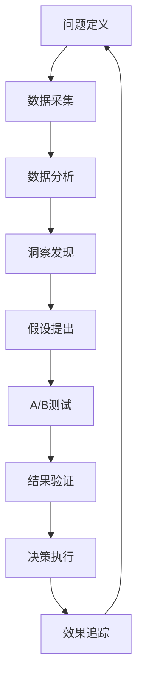

# AI智能桌宠 - 数据分析方案

---

## 文档信息

| 项目 | 内容 |
|------|------|
| **产品名称** | AI智能桌宠 |
| **文档版本** | V1.0 |
| **创建日期** | 2026年6月 |
| **作者** | AI产品经理 |

---

## 目录

1. [数据分析目标](#1-数据分析目标)
2. [核心指标体系](#2-核心指标体系)
3. [数据采集方案](#3-数据采集方案)
4. [数据分析方法](#4-数据分析方法)
5. [A/B测试框架](#5-AB测试框架)
6. [效果评估方法论](#6-效果评估方法论)

---

## 1. 数据分析目标

### 1.1 目标概述

| 目标类型 | 描述 |
|----------|------|
| **用户增长** | 监控用户获取、激活、留存 |
| **产品优化** | 基于数据优化功能体验 |
| **商业价值** | 衡量产品价值与变现潜力 |
| **运营效率** | 优化运营策略与资源配置 |

### 1.2 具体目标

1. 提升用户留存率（D7≥40%）
2. 提高用户活跃度（日均消息数≥10）
3. 优化功能使用（任务完成率≥60%）
4. 提升用户满意度（NPS≥50）

---

## 2. 核心指标体系

### 2.1 用户增长指标

| 指标 | 定义 | 计算公式 | 目标值 |
|------|------|----------|--------|
| **DAU** | 日活跃用户 | 每日至少有一次交互的用户数 | ≥10万 |
| **MAU** | 月活跃用户 | 每月至少有一次交互的用户数 | ≥50万 |
| **新增用户** | 每日新增注册用户 | 当日首次使用的用户数 | ≥1000/日 |
| **留存率** | D1/D7/D30留存 | 第N日仍活跃的用户占首日用户比例 | D7≥40% |
| **转化率** | 激活转化率 | 完成核心操作的用户占比 | ≥80% |

### 2.2 用户行为指标

| 指标 | 定义 | 计算公式 | 目标值 |
|------|------|----------|--------|
| **会话次数** | 日均会话数/用户 | 每日会话数/DAU | ≥5 |
| **消息发送** | 日均消息数/用户 | 每日消息数/DAU | ≥10 |
| **功能使用** | 功能使用率 | 使用某功能的用户/DAU | 聊天≥90% |
| **任务完成率** | 完成任务比例 | 已完成任务/总任务 | ≥60% |
| **日程创建** | 日均日程数/用户 | 每日创建日程数/DAU | ≥0.5 |

### 2.3 产品质量指标

| 指标 | 定义 | 计算公式 | 目标值 |
|------|------|----------|--------|
| **响应时间** | AI响应延迟 | 从发送到回复的平均时间 | ≤2秒 |
| **错误率** | 请求失败比例 | 失败请求数/总请求数 | ≤0.1% |
| **可用性** | 应用可用时间 | 可用时间/总时间 | ≥99.9% |
| **NPS** | 用户净推荐值 | (推荐者-贬损者)/总数×100 | ≥50 |

### 2.4 业务价值指标

| 指标 | 定义 | 计算公式 | 目标值 |
|------|------|----------|--------|
| **用户生命周期** | 用户使用时长 | 从注册到最后活跃的天数 | ≥30天 |
| **LTV** | 用户生命周期价值 | 单用户贡献价值 | 待定义 |
| **ARPU** | 单用户平均收入 | 总收入/用户数 | 待定义 |
| **付费转化率** | 付费用户比例 | 付费用户/总用户 | ≥5% |

---

## 3. 数据采集方案

### 3.1 数据类型

| 数据类型 | 内容 | 采集方式 | 存储位置 |
|----------|------|----------|----------|
| **用户行为** | 点击、浏览、输入 | 前端埋点 | 本地+云端 |
| **会话数据** | 消息内容、时间 | 自动记录 | 本地 |
| **系统日志** | 错误、性能 | 自动收集 | 本地 |
| **用户反馈** | 评分、评论 | 主动收集 | 云端 |

### 3.2 事件定义

#### 3.2.1 核心事件

| 事件名称 | 事件描述 | 属性 |
|----------|----------|------|
| `app_open` | 应用启动 | `timestamp`, `version`, `platform` |
| `app_close` | 应用关闭 | `timestamp`, `duration` |
| `message_send` | 用户发送消息 | `timestamp`, `content_length` |
| `message_receive` | 用户接收消息 | `timestamp`, `response_time` |
| `task_add` | 添加任务 | `timestamp`, `task_text` |
| `task_complete` | 完成任务 | `timestamp`, `task_id` |
| `schedule_create` | 创建日程 | `timestamp`, `title`, `date` |
| `reminder_trigger` | 触发提醒 | `timestamp`, `schedule_id` |
| `pet_interact` | 宠物交互 | `timestamp`, `action_type` |

#### 3.2.2 用户属性

| 属性名称 | 描述 | 类型 |
|----------|------|------|
| `user_id` | 用户唯一标识 | UUID |
| `device_id` | 设备标识 | String |
| `platform` | 操作系统 | Windows/macOS/Linux |
| `version` | 应用版本 | String |
| `install_date` | 安装日期 | Date |
| `last_active` | 最后活跃时间 | Date |

### 3.3 采集策略

| 策略 | 描述 | 实施方式 |
|------|------|----------|
| **实时采集** | 事件发生时立即上报 | 前端SDK |
| **批量上传** | 定时批量发送 | 后台任务 |
| **本地优先** | 优先本地存储 | 离线缓存 |
| **隐私保护** | 匿名化处理 | 数据脱敏 |

---

## 4. 数据分析方法

### 4.1 用户行为分析

#### 4.1.1 用户分群

| 分群维度 | 分群方式 | 分析目的 |
|----------|----------|----------|
| **新老用户** | 注册时间 | 分析生命周期差异 |
| **活跃度** | 互动频率 | 识别核心用户 |
| **功能偏好** | 使用功能 | 优化功能优先级 |
| **平台** | 操作系统 | 针对性优化 |

#### 4.1.2 漏斗分析

| 漏斗步骤 | 目标转化率 |
|----------|----------|
| 安装→启动 | ≥90% |
| 启动→引导 | ≥85% |
| 引导→聊天 | ≥80% |
| 聊天→其他功能 | ≥60% |
| 首日→次日 | ≥60% |

### 4.2 留存分析

#### 4.2.1 留存曲线分析

| 留存类型 | 分析重点 |
|----------|----------|
| **D1留存** | 首次体验质量 |
| **D7留存** | 功能价值感知 |
| **D30留存** | 用户粘性 |

#### 4.2.2 留存提升策略

| 阶段 | 策略 | 指标 |
|------|------|------|
| 首日 | 引导优化 | D1留存 |
| 首周 | 功能探索 | D7留存 |
| 首月 | 习惯养成 | D30留存 |

### 4.3 转化分析

#### 4.3.1 功能转化路径

| 路径 | 分析方法 | 优化方向 |
|------|----------|----------|
| 聊天→任务 | 漏斗分析 | 入口引导 |
| 聊天→日程 | 漏斗分析 | 智能推荐 |
| 任务→完成 | 转化率分析 | 任务设计 |

---

## 5. A/B测试框架

### 5.1 测试流程

### 5.2 测试设计要素

| 要素 | 说明 | 示例 |
|------|------|------|
| **假设** | 测试目标 | 新引导提升D1留存 |
| **变量** | 变化内容 | 引导流程修改 |
| **样本量** | 用户数量 | ≥1000/组 |
| **周期** | 测试时长 | ≥7天 |
| **指标** | 衡量标准 | D1留存率 |

### 5.3 测试类型

| 测试类型 | 用途 | 示例 |
|----------|------|------|
| **功能测试** | 新功能效果 | 语音功能上线 |
| **体验测试** | UI/UX优化 | 界面改版 |
| **策略测试** | 运营策略 | 推送频率 |
| **算法测试** | AI能力 | 回复质量 |

### 5.4 结果评估

| 评估指标 | 标准 |
|----------|------|
| **统计显著性** | p-value < 0.05 |
| **效果提升** | ≥5% |
| **用户反馈** | NPS提升 |

---

## 6. 效果评估方法论

### 6.1 评估维度

| 维度 | 评估内容 | 指标 |
|------|----------|------|
| **用户增长** | 用户获取与留存 | DAU、留存率 |
| **用户参与** | 活跃度与互动 | 消息数、会话数 |
| **产品质量** | 性能与稳定性 | 响应时间、错误率 |
| **用户满意** | 主观评价 | NPS、评分 |
| **商业价值** | 变现潜力 | LTV、ARPU |

### 6.2 评估周期

| 周期 | 评估内容 | 频率 |
|------|----------|------|
| **日报告** | 核心指标监控 | 每日 |
| **周报告** | 趋势分析 | 每周 |
| **月报告** | 综合评估 | 每月 |
| **季度报告** | 战略评估 | 每季度 |

### 6.3 数据可视化

| 图表类型 | 用途 | 示例 |
|----------|------|------|
| **折线图** | 趋势变化 | DAU趋势 |
| **柱状图** | 对比分析 | 功能使用对比 |
| **漏斗图** | 转化分析 | 用户转化漏斗 |
| **热力图** | 行为分布 | 功能点击热图 |
| **表格** | 详细数据 | 指标对比表 |

### 6.4 数据驱动决策流程

---

## 7. 数据安全与隐私

### 7.1 数据安全措施

| 措施 | 描述 |
|------|------|
| **数据加密** | 传输和存储加密 |
| **访问控制** | 权限分级管理 |
| **数据脱敏** | 用户身份匿名化 |
| **备份恢复** | 定期数据备份 |

### 7.2 隐私保护原则

| 原则 | 描述 |
|------|------|
| **最小化采集** | 只采集必要数据 |
| **透明告知** | 明确数据用途 |
| **用户控制** | 数据删除权利 |
| **合规处理** | 遵守隐私法规 |

---

## 8. 工具与技术栈

| 工具 | 用途 | 选型 |
|------|------|------|
| **数据采集** | 前端埋点 | 自定义SDK |
| **数据存储** | 数据仓库 | SQLite/PostgreSQL |
| **数据分析** | 数据处理 | Python/Pandas |
| **可视化** | 图表展示 | ECharts/Tableau |
| **A/B测试** | 实验框架 | 自定义实现 |

---

*AI智能桌宠 - 数据分析方案* 🐱💖