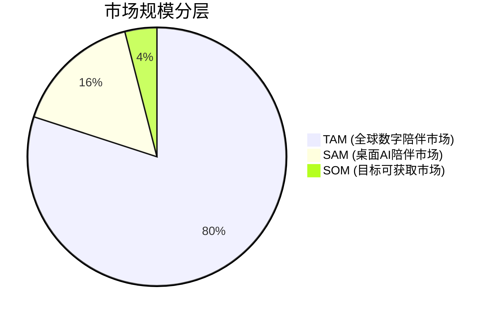
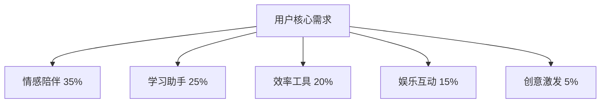

# AI智能桌宠 - 市场分析与竞品调研报告

---

## 文档信息

| 项目 | 内容 |
|------|------|
| **产品名称** | AI智能桌宠 |
| **文档版本** | V1.0 |
| **创建日期** | 2026年6月 |
| **作者** | AI产品经理 |

---

## 目录

1. [市场规模分析](#1-市场规模分析)
2. [目标用户画像](#2-目标用户画像)
3. [竞品分析](#3-竞品分析)
4. [差异化竞争策略](#4-差异化竞争策略)
5. [市场进入建议](#5-市场进入建议)

---

## 1. 市场规模分析

### 1.1 全球AI陪伴市场

| 指标 | 数值 | 来源 |
|------|------|------|
| 全球AI聊天机器人市场规模 | 约$100亿 (2026) | Statista |
| 复合年增长率(CAGR) | 25-30% | 行业报告 |
| 情感AI细分市场 | 约$15亿 (2026) | Grand View Research |
| 桌面宠物市场规模 | 约$5亿 (2026) | 市场研究 |

### 1.2 TAM/SAM/SOM模型



| 市场层级 | 定义 | 规模 | 说明 |
|----------|------|------|------|
| **TAM** | 全球数字陪伴市场 | $100亿+ | 所有潜在用户 |
| **SAM** | 桌面AI陪伴细分市场 | $20亿 | 桌面端用户群体 |
| **SOM** | 目标可获取市场 | $5亿 | 1-3年内可占领份额 |

### 1.3 市场趋势

| 趋势 | 描述 | 影响 |
|------|------|------|
| LLM普及 | 大语言模型能力提升，对话更自然 | 降低AI开发门槛，提升用户体验 |
| 情感计算 | AI情感理解能力增强 | 推动情感陪伴产品发展 |
| 多模态交互 | 语音、图像、视频融合 | 丰富交互方式 |
| 隐私保护 | 用户对数据安全关注度提升 | 推动本地AI部署 |
| 个性化需求 | 用户期望定制化体验 | 需要更强的用户记忆能力 |

---

## 2. 目标用户画像

### 2.1 用户群体细分

| 用户群体 | 年龄 | 占比 | 核心需求 |
|----------|------|------|----------|
| **大学生** | 18-24岁 | 40% | 情感陪伴、学习助手 |
| **职场新人** | 25-30岁 | 30% | 效率工具、日程管理 |
| **宅家青年** | 18-35岁 | 20% | 娱乐互动、社交替代 |
| **创意工作者** | 25-40岁 | 10% | 创意激发、灵感助手 |

### 2.2 用户画像详情

#### 用户画像1：大学生小明
```
- 年龄：20岁
- 身份：计算机专业大二学生
- 场景：宿舍学习、图书馆自习
- 需求：
  - 学习压力大，需要情感支持
  - 希望有个有趣的学习伙伴
  - 需要学习资料查询帮助
- 痛点：
  - 独自学习感到孤独
  - 缺乏学习动力
  - 时间管理困难
```

#### 用户画像2：职场新人小红
```
- 年龄：24岁
- 身份：产品助理
- 场景：办公室工作、居家办公
- 需求：
  - 工作繁忙，需要日程管理
  - 希望有贴心的工作提醒
  - 需要快速查询资料
- 痛点：
  - 日程安排混乱
  - 工作压力大无人倾诉
  - 信息获取效率低
```

#### 用户画像3：宅家青年小华
```
- 年龄：22岁
- 身份：自由职业者
- 场景：居家工作、休闲娱乐
- 需求：
  - 社交圈小，需要虚拟陪伴
  - 希望打发闲暇时间
  - 需要创意灵感激发
- 痛点：
  - 孤独感强
  - 缺乏生活乐趣
  - 创意产出困难
```

### 2.3 用户需求优先级



---

## 3. 竞品分析

### 3.1 主要竞品列表

| 竞品 | 类型 | 核心功能 | 优势 | 劣势 |
|------|------|----------|------|------|
| **Character.AI** | 网页端AI聊天 | 角色扮演、多角色 | 角色丰富、对话自然 | 需网页访问、无桌面端 |
| **Replika** | 移动端AI伴侣 | 情感陪伴、日记 | 情感理解强 | 移动端为主、功能单一 |
| **Suno AI** | AI聊天机器人 | 多模态、语音 | 语音交互好 | 缺乏桌面宠物形态 |
| **My Talking Tom** | 移动端宠物 | 虚拟宠物养成 | 形象可爱、互动丰富 | 缺乏AI对话能力 |
| **Microsoft Copilot** | 桌面AI助手 | 办公辅助、多任务 | 深度整合Windows | 缺乏情感陪伴属性 |

### 3.2 竞品功能对比矩阵

| 功能 | Character.AI | Replika | Suno AI | My Talking Tom | Microsoft Copilot | **AI智能桌宠** |
|------|--------------|---------|---------|----------------|------------------|------------------|
| 自然对话 | ⭐⭐⭐⭐⭐ | ⭐⭐⭐⭐ | ⭐⭐⭐⭐ | ⭐⭐ | ⭐⭐⭐⭐⭐ | ⭐⭐⭐⭐⭐ |
| 情感理解 | ⭐⭐⭐⭐ | ⭐⭐⭐⭐⭐ | ⭐⭐⭐ | ⭐⭐⭐ | ⭐⭐ | ⭐⭐⭐⭐⭐ |
| 桌面端 | ❌ | ❌ | ❌ | ❌ | ⭐⭐⭐⭐⭐ | ⭐⭐⭐⭐⭐ |
| 宠物形象 | ⭐⭐⭐ | ⭐⭐ | ⭐⭐⭐ | ⭐⭐⭐⭐⭐ | ❌ | ⭐⭐⭐⭐⭐ |
| 日程管理 | ❌ | ❌ | ❌ | ❌ | ⭐⭐⭐⭐ | ⭐⭐⭐⭐ |
| 待办任务 | ❌ | ❌ | ❌ | ❌ | ⭐⭐⭐ | ⭐⭐⭐⭐ |
| 语音交互 | ⭐⭐⭐ | ⭐⭐⭐⭐ | ⭐⭐⭐⭐⭐ | ⭐⭐ | ⭐⭐⭐⭐ | ⭐⭐⭐⭐ |
| 图片生成 | ⭐⭐⭐ | ❌ | ⭐⭐⭐⭐ | ❌ | ⭐⭐⭐ | ⭐⭐⭐⭐⭐ |
| 本地运行 | ❌ | ❌ | ❌ | ⭐⭐⭐⭐⭐ | ❌ | ⭐⭐⭐⭐⭐ |

### 3.3 竞品SWOT分析

#### Character.AI
- **优势**: 角色丰富、社区活跃、对话质量高
- **劣势**: 网页端限制、无桌面宠物、隐私担忧
- **机会**: 移动端拓展、更多角色类型
- **威胁**: 同质化竞争、API成本上升

#### Replika
- **优势**: 情感理解深、用户粘性高、社交属性强
- **劣势**: 功能单一、移动端为主、缺乏效率工具
- **机会**: 多平台扩展、功能多元化
- **威胁**: 情感AI新进入者

#### Microsoft Copilot
- **优势**: 系统级整合、办公能力强、资源丰富
- **劣势**: 缺乏情感属性、过于工具化、隐私问题
- **机会**: 深度整合Office生态
- **威胁**: 专用AI助手竞争

---

## 4. 差异化竞争策略

### 4.1 差异化定位

```
┌─────────────────────────────────────────────────────┐
│                    市场定位矩阵                     │
├─────────────────────────────────────────────────────┤
│         情感陪伴                    效率工具         │
│                                                    │
│  [AI智能桌宠]     [Replika]              [Copilot] │
│    ⬆️                                              │
│  桌面宠物                                          │
│    ⬇️                                              │
│  [Talking Tom]                                     │
│                                                    │
└─────────────────────────────────────────────────────┘
```

### 4.2 核心差异化卖点

| 卖点 | 描述 | 竞品对比 |
|------|------|----------|
| **桌面原生体验** | 真正的桌面应用，无需浏览器 | Character.AI/Replika仅网页/移动端 |
| **AI+宠物融合** | 可爱宠物形象+强大AI对话能力 | Talking Tom缺乏AI能力 |
| **本地LLM支持** | 支持Ollama本地运行，隐私保护 | 竞品多依赖云端 |
| **效率工具集成** | 日程管理+待办任务+学习助手 | Replika功能单一 |
| **多模态交互** | 文字+语音+图像生成 | 多数竞品功能单一 |

### 4.3 竞争策略框架

#### 产品策略
- **情感优先**: 强化情感陪伴属性，区别于工具型AI
- **场景深耕**: 专注学习、工作、休闲三大场景
- **体验极致**: 流畅动画、自然交互、响应迅速

#### 市场策略
- **目标用户聚焦**: 大学生和年轻职场人
- **渠道选择**: 校园推广、社交媒体、应用商店
- **定价策略**: 免费基础版+付费高级功能

#### 技术策略
- **本地优先**: 支持Ollama本地运行
- **云端降级**: 网络不佳时自动切换本地模式
- **API优化**: 智能缓存、请求合并、成本控制

---

## 5. 市场进入建议

### 5.1 目标市场选择

| 市场 | 优先级 | 理由 |
|------|--------|------|
| **中国** | ⭐⭐⭐⭐⭐ | 人口基数大、AI接受度高、市场空白 |
| **美国** | ⭐⭐⭐⭐ | 技术领先、付费意愿强 |
| **日韩** | ⭐⭐⭐ | 虚拟宠物文化成熟 |

### 5.2 进入策略

#### 第一阶段（种子期）
- **目标**: 获取首批种子用户
- **策略**: 校园推广、KOL合作、产品内测
- **指标**: 1000+活跃用户，NPS≥40

#### 第二阶段（成长期）
- **目标**: 用户增长与留存
- **策略**: 应用商店优化、社交媒体营销、功能迭代
- **指标**: 10万+DAU，D7留存≥35%

#### 第三阶段（扩张期）
- **目标**: 市场占领与商业化
- **策略**: 付费功能上线、跨平台拓展、品牌建设
- **指标**: 100万+DAU，商业化收入

### 5.3 风险评估

| 风险 | 可能性 | 影响 | 应对策略 |
|------|--------|------|----------|
| 竞品模仿 | 高 | 差异化减弱 | 持续创新、快速迭代 |
| API成本 | 中 | 盈利压力 | 本地LLM替代、成本控制 |
| 用户留存 | 中 | 用户流失 | 持续挖掘用户需求 |
| 技术壁垒 | 低 | 竞争加剧 | 构建数据壁垒、品牌认知 |

---

## 6. 总结

### 6.1 市场机会

1. **情感陪伴需求旺盛**: 孤独感成为普遍社会问题
2. **LLM技术成熟**: AI对话能力大幅提升
3. **桌面端空白**: 缺乏兼具情感陪伴和效率工具的桌面AI产品
4. **隐私需求增长**: 用户对数据安全关注度提升，本地AI有优势

### 6.2 核心建议

1. **聚焦差异化**: 强化桌面宠物+AI对话的独特定位
2. **用户体验优先**: 打造流畅、可爱、有温度的产品体验
3. **技术创新**: 支持本地LLM，解决隐私顾虑
4. **快速迭代**: 根据用户反馈持续优化产品

---

*AI智能桌宠 - 市场分析与竞品调研报告* 🐱💖