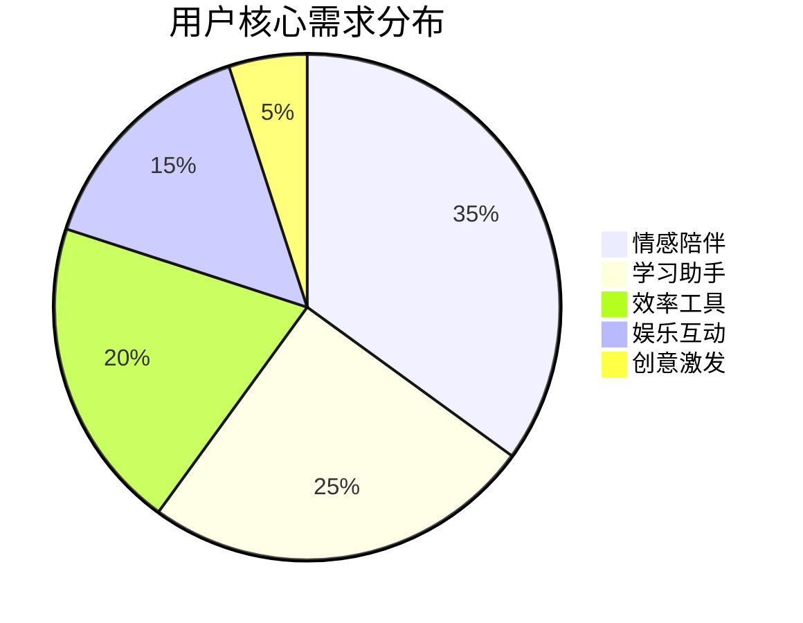
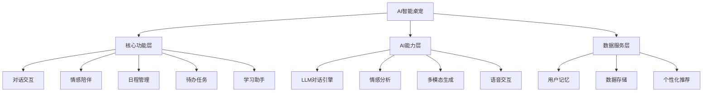

# AI智能桌宠 - 产品需求文档 (PRD)

---

## 文档信息

| 项目 | 内容 |
|------|------|
| **产品名称** | AI智能桌宠 (AI Pet Companion) |
| **文档版本** | V1.0 |
| **创建日期** | 2026年6月 |
| **作者** | AI产品经理 |
| **状态** | 评审中 |

---

## 目录

1. [产品概述](#1-产品概述)
2. [用户画像](#2-用户画像)
3. [功能需求](#3-功能需求)
4. [非功能需求](#4-非功能需求)
5. [验收标准](#5-验收标准)
6. [数据指标](#6-数据指标)
7. [风险与依赖](#7-风险与依赖)
8. [附录](#8-附录)

---

## 1. 产品概述

### 1.1 产品愿景

> **成为用户桌面上最贴心的AI情感陪伴伙伴，通过自然对话、情感理解和智能服务，为用户创造温暖、有趣、高效的数字生活体验。**

### 1.2 产品定位

| 维度 | 描述 |
|------|------|
| **产品类型** | 桌面AI情感陪伴应用 |
| **目标用户** | 学生群体、年轻白领、数字原住民 |
| **核心价值** | 情感陪伴、智能助手、个性化服务 |
| **差异化定位** | 结合LLM能力的轻量级桌面宠物，兼具娱乐性与实用性 |

### 1.3 产品目标

#### 业务目标
- 日活跃用户(DAU)达到10万
- 用户留存率：D7≥40%，D30≥25%
- 用户满意度(NPS)≥50

#### 功能目标
- 提供自然流畅的AI对话体验
- 实现多模态交互（文字、语音、图像）
- 建立用户长期记忆和个性化服务

---

## 2. 用户画像

### 2.1 核心用户群体

| 用户角色 | 描述 | 需求痛点 |
|----------|------|----------|
| **大学生小明** | 20岁，计算机专业 | 学习压力大，需要情感陪伴，希望有个有趣的学习伙伴 |
| **职场新人小红** | 24岁，产品助理 | 工作繁忙，需要日程管理和效率工具，希望有贴心提醒 |
| **宅家青年小华** | 22岁，自由职业 | 社交圈小，希望有个虚拟陪伴，打发闲暇时间 |
| **创意工作者小李** | 28岁，设计师 | 需要灵感激发，希望AI能提供创意建议和图片生成 |

### 2.2 用户需求分析

---

## 3. 功能需求

### 3.1 功能架构

### 3.2 用户故事清单

#### 3.2.1 对话交互模块

| ID | 用户故事 | 优先级 | 描述 |
|----|----------|--------|------|
| US-001 | 作为用户，我希望能与桌宠进行自然对话 | **Must** | 用户输入文字消息，桌宠能理解并给出合适回应 |
| US-002 | 作为用户，我希望对话历史能被保存 | **Must** | 对话记录自动保存，重启后可查看 |
| US-003 | 作为用户，我希望支持语音输入 | **Should** | 点击麦克风按钮，语音转文字发送 |
| US-004 | 作为用户，我希望支持语音回复 | **Should** | 桌宠可以语音方式回复消息 |
| US-005 | 作为用户，我希望能发送图片给桌宠 | **Could** | 支持图片输入，桌宠能理解图片内容 |
| US-006 | 作为用户，我希望能清空对话记录 | **Could** | 一键清空所有对话历史 |

#### 3.2.2 情感陪伴模块

| ID | 用户故事 | 优先级 | 描述 |
|----|----------|--------|------|
| US-007 | 作为用户，我希望桌宠能感知我的情绪 | **Must** | 分析用户消息中的情感倾向 |
| US-008 | 作为用户，我希望桌宠有多种情绪状态 | **Must** | 开心、难过、困倦、思考等状态 |
| US-009 | 作为用户，我希望桌宠能主动问候我 | **Must** | 根据时间和使用习惯主动发起对话 |
| US-010 | 作为用户，我希望桌宠有可爱的动画效果 | **Must** | 点击、互动时有动画反馈 |
| US-011 | 作为用户，我希望能自定义桌宠外观 | **Should** | 更换宠物角色、颜色、服装 |
| US-012 | 作为用户，我希望桌宠能记住我的喜好 | **Should** | 根据对话历史学习用户偏好 |

#### 3.2.3 日程管理模块

| ID | 用户故事 | 优先级 | 描述 |
|----|----------|--------|------|
| US-013 | 作为用户，我希望能添加日程事件 | **Must** | 创建包含标题、时间、描述的日程 |
| US-014 | 作为用户，我希望能收到日程提醒 | **Must** | 事件前10分钟弹出提醒通知 |
| US-015 | 作为用户，我希望能查看日程列表 | **Must** | 按时间顺序展示所有日程 |
| US-016 | 作为用户，我希望能编辑日程 | **Should** | 修改已创建的日程信息 |
| US-017 | 作为用户，我希望能删除日程 | **Should** | 删除不需要的日程事件 |
| US-018 | 作为用户，我希望日程能重复提醒 | **Could** | 支持每日/每周/每月重复 |

#### 3.2.4 待办任务模块

| ID | 用户故事 | 优先级 | 描述 |
|----|----------|--------|------|
| US-019 | 作为用户，我希望能添加待办任务 | **Must** | 快速创建待办事项 |
| US-020 | 作为用户，我希望能标记任务完成 | **Must** | 点击复选框标记完成状态 |
| US-021 | 作为用户，我希望能查看任务列表 | **Must** | 展示所有待办任务 |
| US-022 | 作为用户，我希望能删除任务 | **Should** | 删除已完成或不需要的任务 |
| US-023 | 作为用户，我希望任务有优先级 | **Should** | 高/中/低优先级标记 |
| US-024 | 作为用户，我希望任务有截止日期 | **Could** | 设置任务截止时间 |

#### 3.2.5 学习助手模块

| ID | 用户故事 | 优先级 | 描述 |
|----|----------|--------|------|
| US-025 | 作为用户，我希望桌宠能帮我查资料 | **Should** | 回答知识性问题 |
| US-026 | 作为用户，我希望能设置学习提醒 | **Should** | 定时提醒学习 |
| US-027 | 作为用户，我希望能获得学习建议 | **Could** | 根据学习情况提供建议 |
| US-028 | 作为用户，我希望能练习英语口语 | **Could** | 语音对话练习 |

#### 3.2.6 多模态功能模块

| ID | 用户故事 | 优先级 | 描述 |
|----|----------|--------|------|
| US-029 | 作为用户，我希望桌宠能生成图片 | **Should** | 根据文字描述生成图片 |
| US-030 | 作为用户，我希望能分享对话内容 | **Could** | 导出或分享对话记录 |
| US-031 | 作为用户，我希望能设置快捷回复 | **Could** | 自定义常用回复模板 |

#### 3.2.7 设置与个性化模块

| ID | 用户故事 | 优先级 | 描述 |
|----|----------|--------|------|
| US-032 | 作为用户，我希望能设置AI模型 | **Should** | 选择不同的LLM模型 |
| US-033 | 作为用户，我希望能调整语音音色 | **Could** | 选择不同的语音合成声音 |
| US-034 | 作为用户，我希望能设置主题风格 | **Could** | 更换应用主题颜色 |
| US-035 | 作为用户，我希望能管理数据存储 | **Could** | 查看/导出/清除本地数据 |

### 3.3 功能优先级矩阵 (MoSCoW)

| 功能模块 | Must (必须) | Should (应该) | Could (可以) | Won't (暂不) |
|----------|-------------|---------------|--------------|--------------|
| 对话交互 | 文字对话、历史保存 | 语音输入输出、图片输入 | 清空记录 | 多语言支持 |
| 情感陪伴 | 情绪感知、状态切换、主动问候、基础动画 | 自定义外观、用户记忆 | 高级交互 | 社交分享 |
| 日程管理 | 添加日程、提醒、列表展示 | 编辑、删除 | 重复提醒 | 日历同步 |
| 待办任务 | 添加任务、完成标记、列表展示 | 删除、优先级 | 截止日期 | 任务分类 |
| 学习助手 | - | 资料查询、学习提醒 | 学习建议、口语练习 | 题库练习 |
| 多模态 | - | 图片生成 | 分享、快捷回复 | AR互动 |
| 设置 | - | AI模型选择 | 语音、主题、数据管理 | 账号系统 |

---

## 4. 非功能需求

### 4.1 性能需求

| 指标 | 要求 | 说明 |
|------|------|------|
| 启动时间 | ≤3秒 | 应用从点击图标到界面完全加载 |
| 响应时间 | ≤500ms | 普通操作的响应延迟 |
| AI响应 | ≤3秒 | LLM对话响应时间（不含网络延迟） |
| 内存占用 | ≤100MB | 正常运行时的内存使用 |
| 存储占用 | ≤50MB | 本地数据存储上限 |

### 4.2 可用性需求

| 指标 | 要求 |
|------|------|
| 可用性 | 99.9% |
| 错误率 | ≤0.1% |
| 用户满意度(NPS) | ≥50 |
| 首次使用学习时间 | ≤5分钟 |

### 4.3 安全性需求

| 需求 | 描述 |
|------|------|
| 数据加密 | 本地数据存储加密 |
| 隐私保护 | 用户对话不上传云端（可选） |
| API安全 | API密钥本地存储，不泄露 |
| 权限管理 | 仅请求必要的系统权限 |

### 4.4 兼容性需求

| 平台 | 版本要求 |
|------|----------|
| Windows | ≥Windows 10 |
| macOS | ≥macOS 10.15 |
| Linux | Ubuntu 20.04+ |

---

## 5. 验收标准

### 5.1 功能验收标准

#### 5.1.1 对话交互
- [ ] 用户输入文字后，桌宠在3秒内给出响应
- [ ] 对话历史自动保存，重启应用后可见
- [ ] 语音输入功能正常，识别准确率≥90%
- [ ] 语音回复功能正常，发音清晰

#### 5.1.2 情感陪伴
- [ ] 桌宠能正确识别用户消息中的情感倾向（准确率≥80%）
- [ ] 情绪状态正确反映在UI上（开心/难过/困倦/思考）
- [ ] 主动问候功能按时间触发（如早上问候）
- [ ] 点击宠物时有动画反馈

#### 5.1.3 日程管理
- [ ] 成功创建日程后，事件显示在列表中
- [ ] 日程提醒在设定时间前10分钟弹出
- [ ] 编辑和删除功能正常工作
- [ ] 日程按时间顺序排序显示

#### 5.1.4 待办任务
- [ ] 任务添加后正确显示在列表
- [ ] 点击复选框正确切换完成状态
- [ ] 任务删除功能正常
- [ ] 优先级标记正确显示

#### 5.1.5 多模态功能
- [ ] 图片生成请求在30秒内返回结果
- [ ] 生成的图片与描述相符

### 5.2 性能验收标准

- [ ] 应用启动时间≤3秒
- [ ] 普通操作响应时间≤500ms
- [ ] AI对话响应时间≤3秒
- [ ] 内存占用≤100MB

### 5.3 用户体验验收标准

- [ ] 用户首次使用引导清晰
- [ ] 界面美观，操作流畅
- [ ] 错误提示友好，易于理解

---

## 6. 数据指标

### 6.1 核心指标

| 指标 | 定义 | 目标值 |
|------|------|--------|
| DAU | 日活跃用户数 | ≥10万 |
| MAU | 月活跃用户数 | ≥50万 |
| D7留存 | 第7天留存率 | ≥40% |
| D30留存 | 第30天留存率 | ≥25% |
| NPS | 用户净推荐值 | ≥50 |
| 会话次数 | 日均会话数/用户 | ≥5 |
| 消息发送 | 日均消息数/用户 | ≥10 |

### 6.2 功能使用指标

| 指标 | 定义 | 目标值 |
|------|------|--------|
| 对话使用率 | 使用对话功能的用户比例 | ≥90% |
| 日程使用率 | 使用日程功能的用户比例 | ≥30% |
| 任务使用率 | 使用待办功能的用户比例 | ≥40% |
| 语音使用率 | 使用语音功能的用户比例 | ≥20% |
| 图片生成率 | 使用图片生成的用户比例 | ≥10% |

### 6.3 质量指标

| 指标 | 定义 | 目标值 |
|------|------|--------|
| 响应成功率 | 成功响应的请求比例 | ≥99% |
| 平均响应时间 | AI对话平均响应时长 | ≤2秒 |
| 错误率 | 请求失败的比例 | ≤0.1% |

---

## 7. 风险与依赖

### 7.1 风险评估

| 风险 | 可能性 | 影响 | 应对策略 |
|------|--------|------|----------|
| API调用成本超支 | 中 | 运营成本增加 | 设置API调用限额，支持本地LLM降级 |
| 网络依赖 | 高 | 离线功能受限 | 实现本地/云端双模式 |
| 数据隐私担忧 | 中 | 用户信任度下降 | 提供数据本地化选项，透明隐私政策 |
| 模型响应延迟 | 中 | 用户体验下降 | 实现流式响应、加载动画 |
| 技术复杂度高 | 高 | 开发周期延长 | 分阶段实施，优先核心功能 |
| 竞品竞争 | 中 | 用户流失 | 持续迭代，突出差异化 |

### 7.2 外部依赖

| 依赖 | 说明 | 备选方案 |
|------|------|----------|
| OpenAI API | LLM对话能力 | Anthropic Claude, Ollama |
| DALL-E API | 图片生成 | Stable Diffusion |
| Whisper API | 语音识别 | 本地Whisper模型 |
| ElevenLabs | 语音合成 | TTS本地模型 |

---

## 8. 附录

### 8.1 术语表

| 术语 | 定义 |
|------|------|
| LLM | 大语言模型 (Large Language Model) |
| DAU | 日活跃用户 (Daily Active Users) |
| MAU | 月活跃用户 (Monthly Active Users) |
| NPS | 净推荐值 (Net Promoter Score) |
| MoSCoW | 需求优先级分类方法 (Must/Should/Could/Won't) |

### 8.2 参考文档

- [产品路线图](roadmap.md)
- [技术架构文档](tech-design.md)
- [用户体验设计文档](ux-journey.md)
- [市场分析报告](market-analysis.md)
- [数据分析方案](data-analysis.md)

---

**文档版本历史**

| 版本 | 日期 | 修改内容 | 作者 |
|------|------|----------|------|
| V1.0 | 2026-06 | 初始版本 | AI产品经理 |

---

*AI智能桌宠 - 产品需求文档* 🐱💖