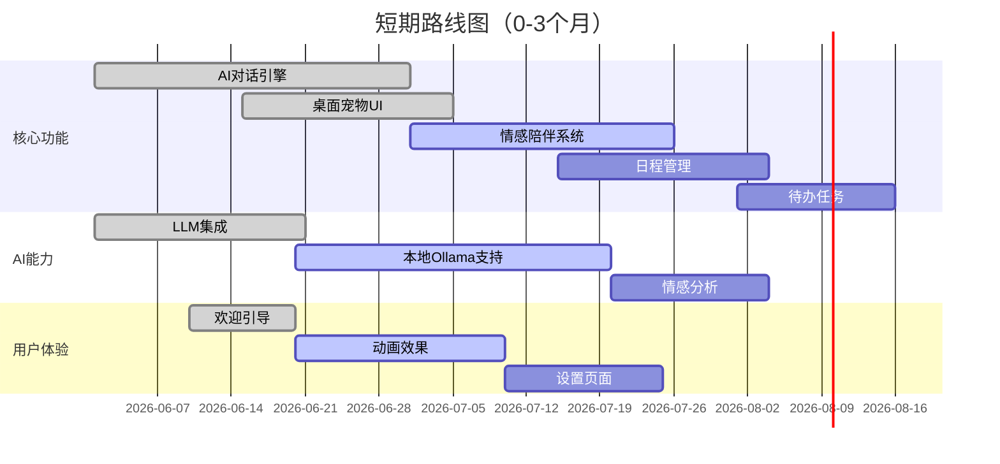
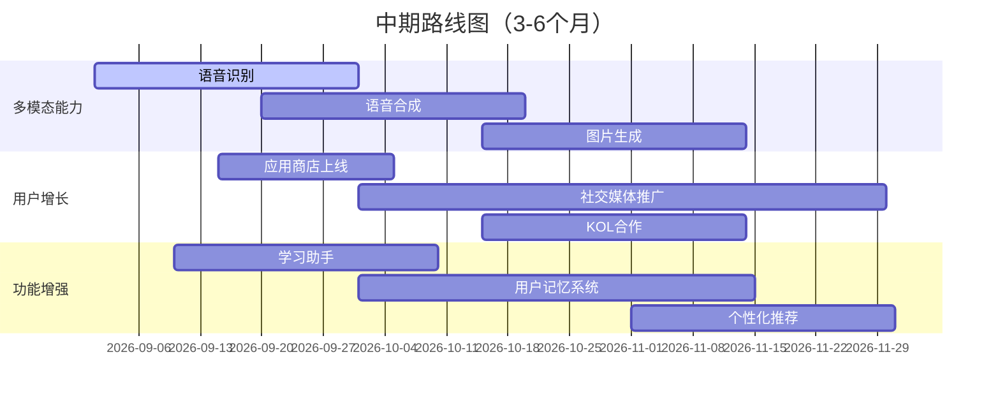
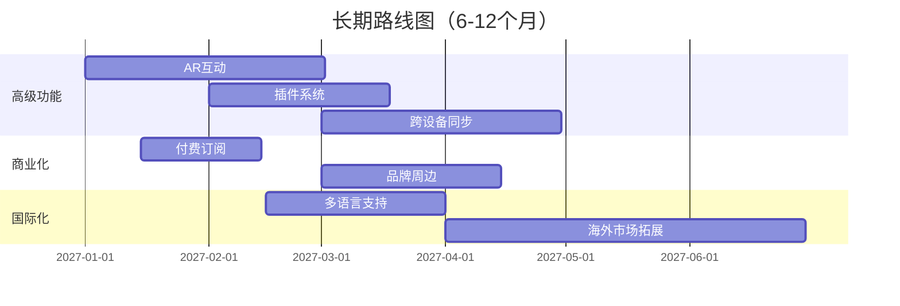
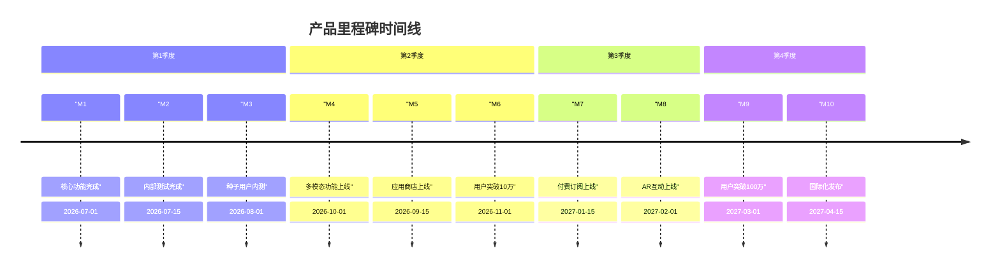

# AI智能桌宠 - 产品迭代路线图

---

## 文档信息

| 项目 | 内容 |
|------|------|
| **产品名称** | AI智能桌宠 |
| **文档版本** | V1.0 |
| **创建日期** | 2026年6月 |
| **作者** | AI产品经理 |

---

## 目录

1. [产品愿景与目标](#1-产品愿景与目标)
2. [短期路线图（0-3个月）](#2-短期路线图0-3个月)
3. [中期路线图（3-6个月）](#3-中期路线图3-6个月)
4. [长期路线图（6-12个月）](#4-长期路线图6-12个月)
5. [关键里程碑](#5-关键里程碑)
6. [资源与依赖](#6-资源与依赖)

---

## 1. 产品愿景与目标

### 1.1 愿景

> **成为用户桌面上最贴心的AI情感陪伴伙伴**

### 1.2 核心目标

| 目标 | 描述 | 时间框架 |
|------|------|----------|
| **用户增长** | 日活跃用户达到10万 | 6个月 |
| **用户留存** | D7留存≥40%，D30留存≥25% | 6个月 |
| **用户满意度** | NPS≥50 | 6个月 |
| **功能完善** | 核心功能完整度≥90% | 3个月 |

---

## 2. 短期路线图（0-3个月）

### 2.1 目标

建立产品核心能力，获取首批种子用户

### 2.2 功能开发



### 2.3 关键任务

| 任务 | 负责人 | 时间 | 状态 |
|------|--------|------|------|
| AI对话引擎开发 | 开发 | 第1-2周 | ✅ 完成 |
| 桌面宠物UI实现 | 开发/设计 | 第2-3周 | ✅ 完成 |
| Ollama本地支持 | 开发 | 第3-6周 | 🔄 进行中 |
| 情感陪伴系统 | 开发 | 第4-7周 | 🔄 进行中 |
| 日程管理功能 | 开发 | 第5-7周 | 📋 待开始 |
| 待办任务功能 | 开发 | 第7-8周 | 📋 待开始 |
| 设置页面 | 开发 | 第6-8周 | 📋 待开始 |

### 2.4 里程碑

- **M1**: 核心功能开发完成（第4周）
- **M2**: 内部测试完成（第6周）
- **M3**: 种子用户内测启动（第8周）

---

## 3. 中期路线图（3-6个月）

### 3.1 目标

完善产品功能，实现用户增长突破

### 3.2 功能开发



### 3.3 关键任务

| 任务 | 负责人 | 时间 | 状态 |
|------|--------|------|------|
| 语音识别集成 | 开发 | 第9-12周 | 🔄 进行中 |
| 语音合成集成 | 开发 | 第11-14周 | 📋 待开始 |
| 图片生成功能 | 开发 | 第13-16周 | 📋 待开始 |
| 应用商店上线 | 产品/运营 | 第10-11周 | 📋 待开始 |
| 学习助手功能 | 开发 | 第10-13周 | 📋 待开始 |
| 用户记忆系统 | 开发 | 第12-17周 | 📋 待开始 |

### 3.4 里程碑

- **M4**: 多模态功能上线（第14周）
- **M5**: 应用商店正式上线（第11周）
- **M6**: 用户突破10万（第16周）

---

## 4. 长期路线图（6-12个月）

### 4.1 目标

打造行业领先的桌面AI陪伴产品

### 4.2 功能开发



### 4.3 关键任务

| 任务 | 负责人 | 时间 |
|------|--------|------|
| AR互动功能 | 开发 | 第17-24周 |
| 插件系统 | 开发 | 第20-25周 |
| 跨设备同步 | 开发 | 第22-28周 |
| 付费订阅上线 | 产品/开发 | 第18-20周 |
| 多语言支持 | 产品/开发 | 第21-26周 |
| 海外市场拓展 | 运营 | 第26-34周 |

### 4.4 里程碑

- **M7**: 付费订阅上线（第20周）
- **M8**: AR互动功能上线（第24周）
- **M9**: 用户突破100万（第30周）
- **M10**: 国际化版本发布（第34周）

---

## 5. 关键里程碑汇总



| 里程碑 | 日期 | 描述 | 成功标准 |
|--------|------|------|----------|
| M1 | 2026-07-01 | 核心功能完成 | 对话、宠物、情感系统可用 |
| M2 | 2026-07-15 | 内部测试完成 | 测试通过率≥95% |
| M3 | 2026-08-01 | 种子用户内测 | 1000+内测用户 |
| M4 | 2026-10-01 | 多模态功能上线 | 语音+图片生成可用 |
| M5 | 2026-09-15 | 应用商店上线 | 在主流应用商店上架 |
| M6 | 2026-11-01 | 用户突破10万 | DAU≥10万 |
| M7 | 2027-01-15 | 付费订阅上线 | 付费功能可用 |
| M8 | 2027-02-01 | AR互动上线 | AR功能可用 |
| M9 | 2027-03-01 | 用户突破100万 | DAU≥100万 |
| M10 | 2027-04-15 | 国际化发布 | 支持3+语言 |

---

## 6. 资源与依赖

### 6.1 团队配置

| 角色 | 人数 | 职责 |
|------|------|------|
| 产品经理 | 1 | 需求定义、路线规划 |
| 前端开发 | 2 | UI开发、交互实现 |
| 后端开发 | 1 | AI集成、数据处理 |
| UI设计师 | 1 | 视觉设计、动效设计 |
| 运营 | 1 | 用户增长、社区管理 |

### 6.2 技术依赖

| 依赖 | 版本 | 用途 |
|------|------|------|
| Electron | 28.x | 桌面应用框架 |
| Vue | 3.x | UI框架 |
| OpenAI SDK | 4.x | LLM集成 |
| Ollama | 0.4.x | 本地LLM |
| Whisper | 2.x | 语音识别 |

### 6.3 风险与应对

| 风险 | 可能性 | 影响 | 应对策略 |
|------|--------|------|----------|
| AI API成本超支 | 中 | 运营成本增加 | 设置调用限额，本地LLM降级 |
| 开发进度延迟 | 中 | 上线推迟 | 敏捷迭代，定期复盘 |
| 用户增长不及预期 | 中 | 目标未达成 | 多元化获客渠道 |
| 竞品竞争加剧 | 高 | 市场份额下降 | 持续创新，强化差异化 |

---

## 7. 版本发布规划

### 版本命名规则

```
v{大版本}.{小版本}.{补丁版本}
```

### 版本路线

| 版本 | 时间 | 主要更新 |
|------|------|----------|
| v1.0.0 | 2026-08 | 核心功能发布 |
| v1.1.0 | 2026-09 | 日程管理上线 |
| v1.2.0 | 2026-10 | 语音功能上线 |
| v1.3.0 | 2026-11 | 图片生成上线 |
| v2.0.0 | 2027-01 | 用户记忆系统 |
| v2.1.0 | 2027-02 | 付费订阅上线 |
| v2.2.0 | 2027-03 | AR互动上线 |
| v3.0.0 | 2027-04 | 国际化版本 |

---

*AI智能桌宠 - 产品迭代路线图* 🐱💖