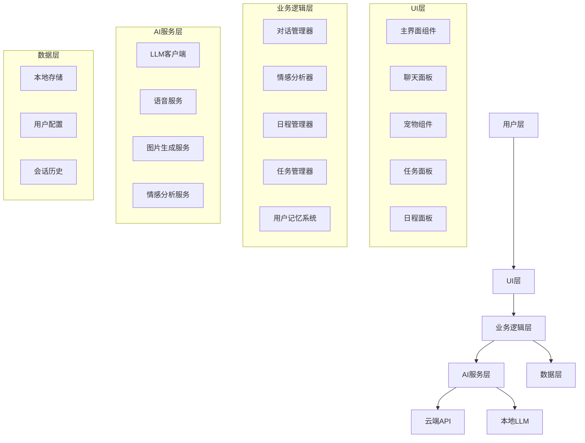
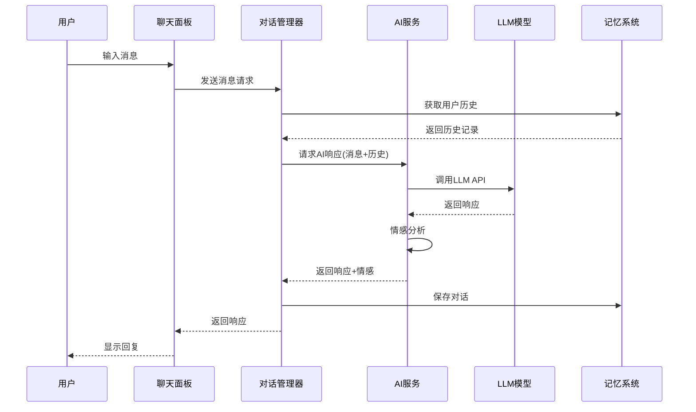
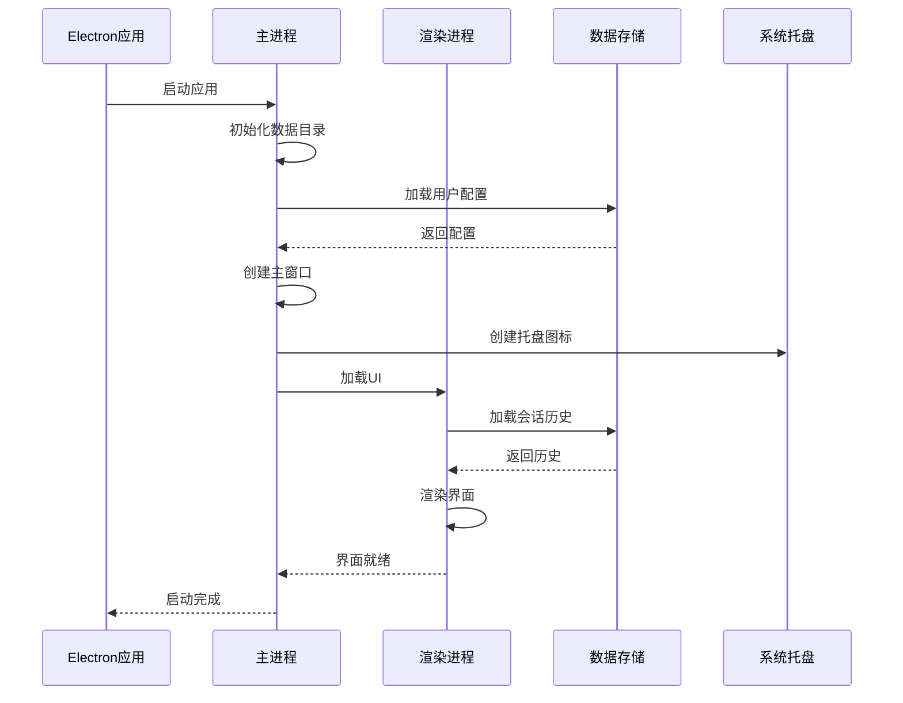
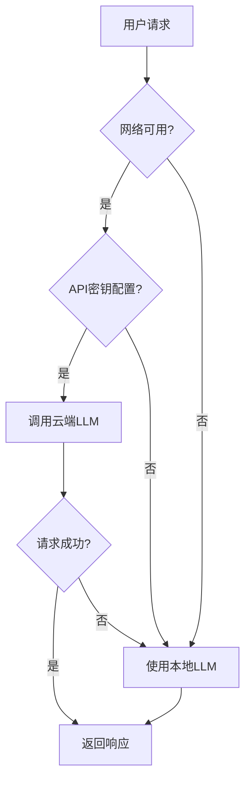

# AI智能桌宠 - 技术架构文档

---

## 文档信息

| 项目 | 内容 |
|------|------|
| **产品名称** | AI智能桌宠 |
| **文档版本** | V1.0 |
| **创建日期** | 2026年6月 |
| **作者** | AI产品经理 |

---

## 目录

1. [架构概述](#1-架构概述)
2. [技术栈选择](#2-技术栈选择)
3. [系统架构](#3-系统架构)
4. [AI技术集成](#4-AI技术集成)
5. [数据存储](#5-数据存储)
6. [API设计](#6-API设计)
7. [安全性考虑](#7-安全性考虑)

---

## 1. 架构概述

### 1.1 架构原则

| 原则 | 描述 |
|------|------|
| **模块化** | 清晰的模块划分，高内聚低耦合 |
| **可扩展** | 支持新增功能和技术替换 |
| **可维护** | 代码结构清晰，易于维护 |
| **高性能** | 响应迅速，资源占用低 |
| **安全性** | 数据加密，隐私保护 |

### 1.2 架构目标

1. 支持多种AI模型（云端+本地）
2. 实现流畅的用户交互体验
3. 确保数据隐私和安全
4. 支持多平台部署（Windows/macOS/Linux）

---

## 2. 技术栈选择

### 2.1 前端技术栈

| 技术 | 选型 | 版本 | 理由 |
|------|------|------|------|
| 框架 | Vue | 3.x | 轻量高效，响应式设计 |
| 构建工具 | Vite | 6.x | 快速构建，热更新 |
| UI | Native CSS | - | 轻量，无需额外依赖 |
| 图标 | Emoji + CSS | - | 简洁，无需图标库 |

### 2.2 桌面技术栈

| 技术 | 选型 | 版本 | 理由 |
|------|------|------|------|
| 框架 | Electron | 28.x | 跨平台桌面应用框架 |
| 打包工具 | Electron Builder | 24.x | 支持多平台打包 |

### 2.3 AI技术栈

| 技术 | 选型 | 版本 | 理由 |
|------|------|------|------|
| 云端LLM | OpenAI GPT-4 | - | 功能强大，API成熟 |
| 云端LLM | Anthropic Claude | - | 长上下文支持 |
| 本地LLM | Ollama | 0.4.x | 隐私保护，离线可用 |
| 语音识别 | Whisper | 2.x | 开源，准确率高 |
| 语音合成 | ElevenLabs | - | 自然语音质量 |
| 图片生成 | DALL-E 3 | - | 生成质量高 |

### 2.4 数据存储

| 技术 | 选型 | 理由 |
|------|------|------|
| 本地存储 | JSON文件 | 轻量，易于实现 |
| 加密 | AES-256 | 数据安全 |

---

## 3. 系统架构

### 3.1 架构层次



### 3.2 模块划分

| 模块 | 职责 | 状态 |
|------|------|------|
| **主进程** | 窗口管理、系统集成 | ✅ |
| **渲染进程** | UI渲染、用户交互 | ✅ |
| **AI服务** | LLM集成、多模态能力 | ✅ |
| **数据服务** | 存储管理、数据持久化 | ✅ |
| **工具服务** | 日程、任务管理 | ✅ |

### 3.3 核心流程图

#### 对话流程



#### 启动流程



---

## 4. AI技术集成

### 4.1 LLM集成策略

#### 4.1.1 云端优先，本地降级



#### 4.1.2 支持的AI模型

| 模型 | 类型 | 配置方式 |
|------|------|----------|
| OpenAI GPT-4 | 云端 | API密钥 |
| Anthropic Claude | 云端 | API密钥 |
| Ollama (Llama 3) | 本地 | 本地部署 |
| Ollama (Qwen) | 本地 | 本地部署 |

### 4.2 多模态能力

#### 4.2.1 语音交互

| 功能 | 实现方式 | 技术 |
|------|----------|------|
| 语音输入 | Whisper API/本地 | 语音转文字 |
| 语音输出 | ElevenLabs/TTS | 文字转语音 |

#### 4.2.2 图片生成

| 功能 | 实现方式 | 技术 |
|------|----------|------|
| 文本生成图片 | DALL-E 3 API | OpenAI |
| 图片理解 | GPT-4V | OpenAI |

### 4.3 情感分析

| 情感类型 | 触发词 | 响应策略 |
|----------|--------|----------|
| 开心 | 开心、高兴、快乐 | 积极回应，表情符号 |
| 难过 | 难过、伤心、不开心 | 安慰回应，鼓励 |
| 生气 | 生气、愤怒、烦 | 安抚，建议冷静 |
| 困惑 | 不懂、不会、困惑 | 详细解释 |
| 疲劳 | 累、困、睡觉 | 建议休息 |

---

## 5. 数据存储

### 5.1 数据结构

#### 5.1.1 会话历史

```json
{
  "conversations": [
    {
      "id": "uuid",
      "type": "user|pet",
      "content": "消息内容",
      "time": "2026-06-24 14:30:00",
      "emotion": "happy|sad|neutral"
    }
  ],
  "lastUpdated": "2026-06-24T14:30:00Z"
}
```

#### 5.1.2 用户配置

```json
{
  "aiModel": "openai|anthropic|ollama",
  "apiKey": "encrypted_key",
  "ollamaModel": "llama3",
  "voiceEnabled": true,
  "theme": "light|dark",
  "autoGreeting": true,
  "reminderEnabled": true
}
```

#### 5.1.3 日程数据

```json
{
  "events": [
    {
      "id": "uuid",
      "title": "会议",
      "date": "2026-06-25",
      "time": "14:00",
      "description": "团队会议",
      "reminder": true,
      "createdAt": "2026-06-24T10:00:00Z"
    }
  ]
}
```

### 5.2 存储策略

| 数据类型 | 存储位置 | 加密方式 |
|----------|----------|----------|
| 会话历史 | 用户数据目录 | AES-256 |
| 用户配置 | 用户数据目录 | AES-256 |
| API密钥 | 用户数据目录 | AES-256 |
| 临时缓存 | 内存 | 无 |

---

## 6. API设计

### 6.1 内部API

#### 6.1.1 AI服务接口

| 方法 | 参数 | 返回 | 说明 |
|------|------|------|------|
| `generateResponse` | `message`, `history` | `response` | 生成AI响应 |
| `generateImage` | `prompt` | `imageUrl` | 生成图片 |
| `speechToText` | `audioData` | `text` | 语音转文字 |
| `textToSpeech` | `text`, `voice` | `audioData` | 文字转语音 |
| `analyzeEmotion` | `text` | `emotion` | 情感分析 |

#### 6.1.2 数据服务接口

| 方法 | 参数 | 返回 | 说明 |
|------|------|------|------|
| `saveConversation` | `conversations` | `boolean` | 保存会话 |
| `loadConversations` | - | `conversations` | 加载会话 |
| `saveConfig` | `config` | `boolean` | 保存配置 |
| `loadConfig` | - | `config` | 加载配置 |
| `saveEvents` | `events` | `boolean` | 保存日程 |
| `loadEvents` | - | `events` | 加载日程 |

### 6.2 外部API

#### 6.2.1 OpenAI API

| 端点 | 方法 | 用途 |
|------|------|------|
| `/v1/chat/completions` | POST | 对话完成 |
| `/v1/images/generations` | POST | 图片生成 |
| `/v1/audio/transcriptions` | POST | 语音转文字 |

#### 6.2.2 Ollama API

| 端点 | 方法 | 用途 |
|------|------|------|
| `/api/generate` | POST | 生成响应 |
| `/api/chat` | POST | 对话 |
| `/api/models` | GET | 获取模型列表 |

---

## 7. 安全性考虑

### 7.1 数据加密

| 数据 | 加密方式 | 密钥管理 |
|------|----------|----------|
| API密钥 | AES-256 | 本地存储，用户密码保护 |
| 会话历史 | AES-256 | 应用密钥 |
| 用户配置 | AES-256 | 应用密钥 |

### 7.2 隐私保护

| 措施 | 描述 |
|------|------|
| 本地优先 | 默认本地存储，不上传云端 |
| 数据清理 | 支持一键清除所有数据 |
| 隐私政策 | 透明的隐私说明 |
| 匿名化 | 不收集用户身份信息 |

### 7.3 安全边界

| 边界 | 措施 |
|------|------|
| 输入验证 | 过滤恶意输入 |
| 输出过滤 | 过滤敏感内容 |
| 资源限制 | API调用限额 |
| 权限控制 | 仅请求必要系统权限 |

---

## 8. 部署与打包

### 8.1 打包配置

| 平台 | 目标格式 | 配置文件 |
|------|----------|----------|
| Windows | NSIS | electron-builder |
| macOS | DMG | electron-builder |
| Linux | DEB | electron-builder |

### 8.2 版本管理

| 版本类型 | 命名 | 示例 |
|----------|------|------|
| 稳定版 | vX.Y.Z | v1.0.0 |
| 测试版 | vX.Y.Z-beta.N | v1.0.0-beta.1 |
| 开发版 | vX.Y.Z-dev.N | v1.0.0-dev.1 |

---

*AI智能桌宠 - 技术架构文档* 🐱💖