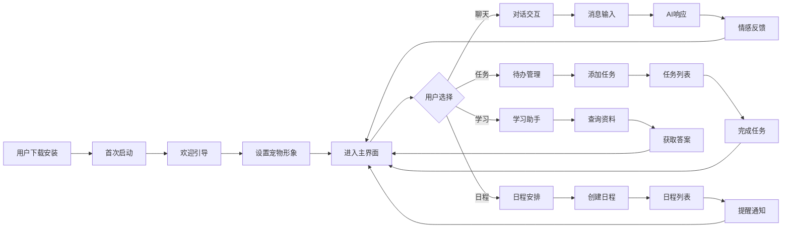
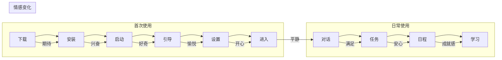

# AI智能桌宠 - 用户体验设计文档

---

## 文档信息

| 项目 | 内容 |
|------|------|
| **产品名称** | AI智能桌宠 |
| **文档版本** | V1.0 |
| **创建日期** | 2026年6月 |
| **作者** | AI产品经理 |

---

## 目录

1. [用户旅程图](#1-用户旅程图)
2. [线框图设计](#2-线框图设计)
3. [交互原型说明](#3-交互原型说明)
4. [视觉设计规范](#4-视觉设计规范)

---

## 1. 用户旅程图

### 1.1 完整用户旅程



### 1.2 用户旅程详细流程

#### 场景一：首次使用体验

| 步骤 | 用户行为 | 系统响应 | 情感状态 | 时间 |
|------|----------|----------|----------|------|
| 1 | 下载并安装应用 | 安装成功提示 | 期待 | 30s |
| 2 | 点击启动图标 | 应用启动动画 | 兴奋 | 3s |
| 3 | 查看欢迎界面 | 展示引导页 | 好奇 | 5s |
| 4 | 选择宠物形象 | 预览并确认 | 愉悦 | 10s |
| 5 | 进入主界面 | 宠物打招呼 | 开心 | 2s |

#### 场景二：日常对话互动

| 步骤 | 用户行为 | 系统响应 | 情感状态 | 时间 |
|------|----------|----------|----------|------|
| 1 | 点击聊天标签 | 切换到聊天面板 | 平静 | 0.5s |
| 2 | 输入消息 | 显示输入状态 | 期待 | 2s |
| 3 | 发送消息 | 宠物思考动画 | 等待 | 1-3s |
| 4 | 接收回复 | 显示AI回复 | 满意/开心 | 1s |
| 5 | 继续对话或切换 | 保持对话历史 | 自然 | - |

#### 场景三：任务管理

| 步骤 | 用户行为 | 系统响应 | 情感状态 | 时间 |
|------|----------|----------|----------|------|
| 1 | 切换到待办面板 | 显示任务列表 | 专注 | 0.5s |
| 2 | 输入任务内容 | 实时输入反馈 | 投入 | 3s |
| 3 | 提交任务 | 添加到列表 | 成就感 | 0.5s |
| 4 | 完成任务 | 勾选动画效果 | 满足 | 0.5s |

#### 场景四：日程提醒

| 步骤 | 用户行为 | 系统响应 | 情感状态 | 时间 |
|------|----------|----------|----------|------|
| 1 | 创建日程 | 表单填写 | 专注 | 10s |
| 2 | 设置提醒时间 | 确认提醒设置 | 安心 | 2s |
| 3 | 等待提醒 | 静默后台运行 | 放心 | - |
| 4 | 收到提醒 | 弹窗+宠物提示 | 注意 | 即时 |
| 5 | 确认提醒 | 标记已读 | 平静 | 1s |

### 1.3 情感曲线



---

## 2. 线框图设计

### 2.1 主界面布局

```
┌─────────────────────────────────────┐
│  ╔═══════════════════════════════╗  │
│  ║          标题栏区域           ║  │
│  ║  [✕]                          ║  │
│  ╚═══════════════════════════════╝  │
├─────────────────────────────────────┤
│  ╔═══════════════════════════════╗  │
│  ║         宠物展示区域          ║  │
│  ║                               ║  │
│  ║       (动画角色展示)          ║  │
│  ║                               ║  │
│  ╚═══════════════════════════════╝  │
├─────────────────────────────────────┤
│  ╔══════╦══════╦══════╗           │
│  ║ 聊天 ║ 待办 ║ 日程 ║ 标签栏   │
│  ╚══════╩══════╩══════╝           │
├─────────────────────────────────────┤
│  ╔═══════════════════════════════╗  │
│  ║         内容区域              ║  │
│  ║  (聊天面板/任务列表/日程列表) ║  │
│  ╚═══════════════════════════════╝  │
└─────────────────────────────────────┘
```

### 2.2 聊天面板

```
┌─────────────────────────────────────┐
│  ┌─────────────┐  ┌─────────────┐   │
│  │   用户头像  │  │   宠物头像  │   │
│  └──────┬──────┘  └──────┬──────┘   │
│         │                │          │
│  ┌──────▼──────┐  ┌──────▼──────┐   │
│  │ 用户消息框  │  │ 宠物消息框  │   │
│  │   (气泡)    │  │   (气泡)    │   │
│  └─────────────┘  └─────────────┘   │
│         │                │          │
│         ...              ...        │
│                                    │
│  ┌───────────────────────────────┐  │
│  │ 输入框 ────────────────► 发送 │  │
│  └───────────────────────────────┘  │
└─────────────────────────────────────┘
```

### 2.3 待办面板

```
┌─────────────────────────────────────┐
│  ┌─────────────────┐  ┌─────────┐  │
│  │    待办事项     │  │ 3项     │  │
│  └─────────────────┘  └─────────┘  │
│                                    │
│  ┌───────────────────────────────┐  │
│  │ [✓] 完成的任务（划线效果）     │  │
│  └───────────────────────────────┘  │
│  ┌───────────────────────────────┐  │
│  │ [ ] 未完成任务                │  │
│  └───────────────────────────────┘  │
│                                    │
│  ┌───────────────────────────────┐  │
│  │ 输入框 ──────────────────► +  │  │
│  └───────────────────────────────┘  │
└─────────────────────────────────────┘
```

### 2.4 日程面板

```
┌─────────────────────────────────────┐
│  ┌─────────────────┐  ┌─────────┐  │
│  │    日程安排     │  │ + 添加  │  │
│  └─────────────────┘  └─────────┘  │
│                                    │
│  ┌───────────────────────────────┐  │
│  │ 🕐 14:00                      │  │
│  │   ├─ 标题：团队会议           │  │
│  │   ├─ 描述：项目进度同步       │  │
│  │   └─ 日期：6月25日 周三      │  │
│  └───────────────────────────────┘  │
│                                    │
│  ┌───────────────────────────────┐  │
│  │ 🕐 16:30                      │  │
│  │   ├─ 标题：健身打卡           │  │
│  │   └─ 日期：6月25日 周三      │  │
│  └───────────────────────────────┘  │
└─────────────────────────────────────┘
```

### 2.5 弹窗设计（添加日程）

```
┌─────────────────────────────────────┐
│           ┌───────────────┐        │
│           │   添加日程    │        │
│           └───────┬───────┘        │
│                   │                │
│  ┌───────────────┐│               │
│  │ 标题：[输入框]││               │
│  └───────────────┘│               │
│  ┌───────────────┐│               │
│  │ 日期：[选择器]││               │
│  └───────────────┘│               │
│  ┌───────────────┐│               │
│  │ 时间：[选择器]││               │
│  └───────────────┘│               │
│  ┌───────────────┐│               │
│  │ 描述：[文本框]││               │
│  └───────────────┘│               │
│                   │               │
│  ┌───────┬───────┐│               │
│  │ 取消  │ 确认  ││               │
│  └───────┴───────┘│               │
│                   ▼               │
└─────────────────────────────────────┘
```

---

## 3. 交互原型说明

### 3.1 核心交互模式

#### 3.1.1 聊天交互

| 交互类型 | 触发方式 | 响应效果 |
|----------|----------|----------|
| 文字输入 | 键盘输入 | 实时显示输入内容 |
| 发送消息 | 回车键/点击发送 | 消息气泡出现，宠物进入思考状态 |
| 接收回复 | AI响应完成 | 消息气泡从宠物头像弹出，宠物恢复正常状态 |
| 滚动查看 | 鼠标滚轮/触摸滑动 | 消息列表平滑滚动 |
| 点击头像 | 单击宠物 | 触发宠物动画（弹跳/挥手） |

#### 3.1.2 任务交互

| 交互类型 | 触发方式 | 响应效果 |
|----------|----------|----------|
| 添加任务 | 回车键/点击+按钮 | 任务添加到列表顶部，淡入动画 |
| 完成任务 | 点击复选框 | 任务划线显示，渐隐效果 |
| 删除任务 | 悬停显示删除按钮 | 任务滑出删除 |

#### 3.1.3 日程交互

| 交互类型 | 触发方式 | 响应效果 |
|----------|----------|----------|
| 创建日程 | 点击添加按钮 | 弹窗滑入 |
| 编辑日程 | 双击日程项 | 弹窗显示当前内容 |
| 删除日程 | 长按/右键菜单 | 确认删除提示 |
| 提醒触发 | 到达设定时间 | 弹窗+宠物提示动画 |

### 3.2 微交互设计

#### 3.2.1 宠物状态动画

| 状态 | 动画效果 | 触发条件 |
|------|----------|----------|
| 空闲 | 呼吸起伏 | 无操作3秒后 |
| 开心 | 尾巴摇摆+笑脸 | 收到积极消息 |
| 难过 | 低头+眼泪 | 收到消极消息 |
| 困倦 | 眼睛半闭+打哈欠 | 夜间/长时间无操作 |
| 思考 | 头上出现💭气泡 | AI处理中 |
| 弹跳 | 上下跳跃 | 点击宠物 |

#### 3.2.2 过渡动画

| 场景 | 动画效果 | 时长 |
|------|----------|------|
| 页面切换 | 淡入淡出 | 300ms |
| 弹窗出现 | 缩放+淡入 | 200ms |
| 列表滚动 | 平滑滚动 | 自然 |
| 状态变化 | 颜色渐变 | 200ms |

---

## 4. 视觉设计规范

### 4.1 色彩系统

| 颜色类型 | 色值 | 用途 |
|----------|------|------|
| 主色调 | #667eea | 按钮、选中状态、重点强调 |
| 辅助色 | #764ba2 | 渐变、装饰元素 |
| 成功色 | #10b981 | 完成状态、确认按钮 |
| 警告色 | #f59e0b | 提醒、警告提示 |
| 错误色 | #ef4444 | 错误提示、删除按钮 |
| 背景色 | #ffffff | 主界面背景 |
| 卡片色 | #f8fafc | 面板、卡片背景 |
| 文字色 | #1f2937 | 主要文字 |
| 次要文字 | #6b7280 | 辅助说明文字 |

### 4.2 字体规范

| 用途 | 字体 | 大小 | 粗细 |
|------|------|------|------|
| 标题 | Microsoft YaHei | 18px | 600 |
| 正文 | Microsoft YaHei | 14px | 400 |
| 辅助文字 | Microsoft YaHei | 12px | 400 |
| 按钮文字 | Microsoft YaHei | 14px | 500 |

### 4.3 间距规范

| 元素 | 间距 |
|------|------|
| 页面边距 | 12px |
| 卡片间距 | 8px |
| 内容间距 | 16px |
| 行高 | 1.5 |

### 4.4 圆角规范

| 元素 | 圆角 |
|------|------|
| 主界面 | 16px |
| 卡片/面板 | 12px |
| 按钮 | 20px（胶囊）/ 8px |
| 头像 | 50%（圆形） |

---

## 5. 用户体验原则

1. **简洁直观**: 界面布局清晰，操作路径简短
2. **情感化设计**: 通过宠物形象和动画传递情感
3. **及时反馈**: 每一个操作都有明确的视觉反馈
4. **容错设计**: 支持撤销、错误提示友好
5. **性能优化**: 动画流畅，响应迅速

---

*AI智能桌宠 - 用户体验设计文档* 🐱💖